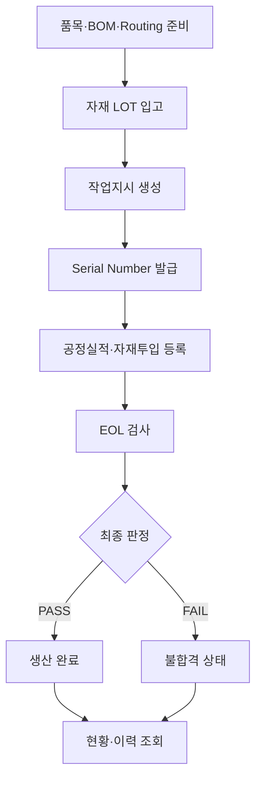

# Actuator Mini MES

> 전기차 HVAC 에어믹스 도어 액추에이터의 조립·검사 공정을 관리하고, 자재 LOT부터 완제품 Serial Number까지 생산이력을 추적하는 Mini MES 프로젝트

## 1. 프로젝트 소개

이 프로젝트는 전기차에 사용되는 소형 전동 액추에이터의 가상 생산공정을 대상으로 MES의 핵심 기능을 직접 설계하고 구현하는 개인 학습 프로젝트입니다.

단순한 CRUD 화면 구현에 그치지 않고, `작업지시 → 자재 투입 → 공정실적 → EOL 검사 → 생산 완료 → 이력 추적`으로 이어지는 생산 흐름을 하나의 시스템 안에서 연결하는 것을 목표로 합니다.

생산 대상은 전기차 HVAC 시스템에서 냉풍과 온풍의 혼합 비율을 조절하는 **에어믹스 도어 액추에이터**입니다.

전기차의 HVAC 시스템은 기존 내연기관 차와는 다른 특성을 가집니다. 전기차의 확산과 함께 기술의 발전으로 변화하고 있습니다.

전기차는 배터리로부터 모든 에너지를 공급받기 때문에 배터리의 성능은 온도에 크게 영향을 받습니다.

HVAC 시스템은 차량 내부를 편안하게 유지하기 위해 많은 에너지를 소모합니다. 따라서 에어믹스 도어 액추에이터는 냉풍과 온풍의 혼합 비율을 제어합니다. 액추에이터의 위치 오차, 구동 지연 또는 기계적 저항은 목표 온도 도달과 공기 흐름 제어에 영향을 줄 수 있습니다. 본 프로젝트는 액추에이터의 위치 정확도와 구동 품질을 생산 단계에서 관리하여 HVAC 시스템이 설계된 성능을 안정적으로 구현하도록 지원하는 것을 목표로 합니다.

> [!NOTE]
> 제품 사양, 공정 및 검사 기준은 실제 특정 기업의 제품을 복제한 것이 아니라 MES 학습을 위해 현실적인 수준으로 단순화한 가상 데이터입니다.

## 2. 프로젝트 목표

- MES의 기준정보, 생산실행, 품질관리, 추적성 구조 이해
- 품목·BOM·Routing을 기반으로 생산 흐름 설계
- 작업지시와 완제품 Serial Number를 연결한 개별 생산 관리
- 완제품별 공정실적과 투입 자재 LOT 기록
- EOL 검사 결과에 따른 합격·불합격 판정
- 자재 LOT와 완제품 Serial Number 사이의 양방향 추적성 구현
- Python, SQLite, Streamlit을 이용한 작은 규모의 MES 완성

## 3. 생산 대상

| 항목 | 내용 |
|---|---|
| 제품명 | 전기차 HVAC 에어믹스 도어 액추에이터 |
| 제품코드 | `HVA-ACT-001` |
| 구동 방식 | 12V 브러시 DC 모터 |
| 감속 방식 | 다단 평기어 감속 |
| 위치 측정 | 가변저항식 위치 센서 |
| 자재 추적 단위 | LOT Number |
| 완제품 추적 단위 | Serial Number |
| 생산라인 | 가상 생산라인 1개 |

## 4. 1차 개발 범위

### 기준정보

- 품목 관리
- BOM 관리
- 공정 및 Routing 관리

### 생산 준비

- 자재 LOT 입고
- 작업지시 생성
- 작업지시별 완제품 Serial Number 발급

### 생산 실행 및 품질

- Serial Number별 공정실적 등록
- 완제품별 투입 자재 LOT 및 사용 수량 등록
- EOL 검사 측정값과 판정 등록
- 완제품과 작업지시의 생산 상태 관리

### 조회 및 추적

- 작업지시별 생산 진행 현황 조회
- 완제품 Serial Number 기준 생산이력 조회
- 자재 LOT 기준 영향 완제품 조회

상세 기능과 완료 조건은 [requirements.md](./requirements.md)에서 관리합니다.

## 5. 생산 흐름



## 6. 공정 Routing 초안

| 공정 코드 | 공정명 | 구분 |
|---|---|---|
| `OP10` | 생산 시작 · 하우징 준비 | 자재 준비 |
| `OP20` | 모터 조립 | 조립 |
| `OP30` | 기어 조립 | 조립 |
| `OP40` | 출력부·위치센서 조 | 조립 |
| `OP50` | PCB·전기부 조립 | 조립 |
| `OP60` | 커버 조립 | 조립 |
| `OP70` | 체결·외관 확인 | 조립 |
| `OP90` | EOL 성능검사 | 성능 검사 |
| `OP100` | 최종 판정·생산 완료 | 최종 완료 |

> Routing은 데이터베이스 설계 단계에서 공정별 입력 데이터와 함께 최종 확정합니다.

## 7. 핵심 추적 관계

```text
작업지시
└── 완제품 Serial Number
    ├── 공정별 작업이력
    ├── 투입 자재 LOT
    └── EOL 검사 결과
```

- 완제품 기준 추적: Serial Number로 작업지시, 공정, 자재 LOT 및 검사 결과 조회
- 자재 기준 추적: 특정 자재 LOT가 사용된 모든 완제품 Serial Number 조회

## 8. 기술 스택

| 영역 | 기술 | 역할 |
|---|---|---|
| Language | Python | 업무 로직 및 데이터 처리 |
| Database | SQLite | 기준정보, 생산, 품질, 추적 데이터 저장 |
| UI | Streamlit | 데이터 등록·조회 화면과 대시보드 |
| Data | pandas | 조회 결과 처리 및 표 형태 출력 |
| Version Control | GitHub | 소스코드와 개발 과정 관리 |

1차 버전에서는 Docker, FastAPI, PLC 및 외부 서버를 사용하지 않습니다.

## 9. 예상 프로젝트 구조

```text
actuator-mini-mes/
├── README.md
├── requirements.md
├── requirements.txt
├── app.py
├── pages/
├── src/
│   ├── db.py
│   ├── ui.py
|   ├── queries.py
│   └── services.py
├── database/
│   ├── schema.sql
│   └── seed.sql
├── docs/
└── tests/
```

## 10. 1차 제외 범위

- 로그인 및 사용자 권한
- 작업자·설비 상세 관리
- 창고 이동, 구매발주 및 복잡한 재고관리
- 재작업·재검사·폐기 처리
- PLC·센서·바코드 장비 실시간 연동
- 설비 OEE와 SPC
- ERP 연동
- AI 불량 예측과 예지보전
- Docker와 FastAPI

이 기능들은 1차 버전을 완성한 뒤 필요성과 학습 효과를 검토하여 2차 개발 범위로 다룹니다.

## 11. 완료 기준

- 기준정보와 자재 LOT를 등록할 수 있다.
- 작업지시를 생성하고 계획수량만큼 Serial Number를 발급할 수 있다.
- Serial Number별 공정실적과 투입 자재 LOT를 기록할 수 있다.
- EOL 검사 결과에 따라 제품을 PASS 또는 FAIL로 판정할 수 있다.
- 작업지시별 계획·진행·합격·불합격 수량을 조회할 수 있다.
- Serial Number로 자재, 공정 및 검사 이력을 조회할 수 있다.
- 자재 LOT로 영향받은 완제품 목록을 조회할 수 있다.

## 12. 개발 순서

1. 요구사항 확정
2. 공정 Routing과 상태 정의
3. ERD 및 테이블 설계
4. `schema.sql`과 `seed.sql` 작성
5. Python DB 연결과 업무 로직 구현
6. Streamlit 화면 구현
7. 정상·불량·LOT 추적 시나리오 검증

## 13. 현재 진행 상태

- [x] 생산 제품 선정
- [x] 액추에이터 도메인 기초 조사
- [x] 1차 개발 범위 선정
- [x] 프로젝트 README 작성
- [x] 요구사항 초안 작성
- [ ] 요구사항 검토 및 확정
- [ ] 공정 Routing 최종 확정
- [ ] ERD 및 데이터베이스 설계
- [ ] 핵심 기능 개발
- [ ] 전체 생산 시나리오 테스트
