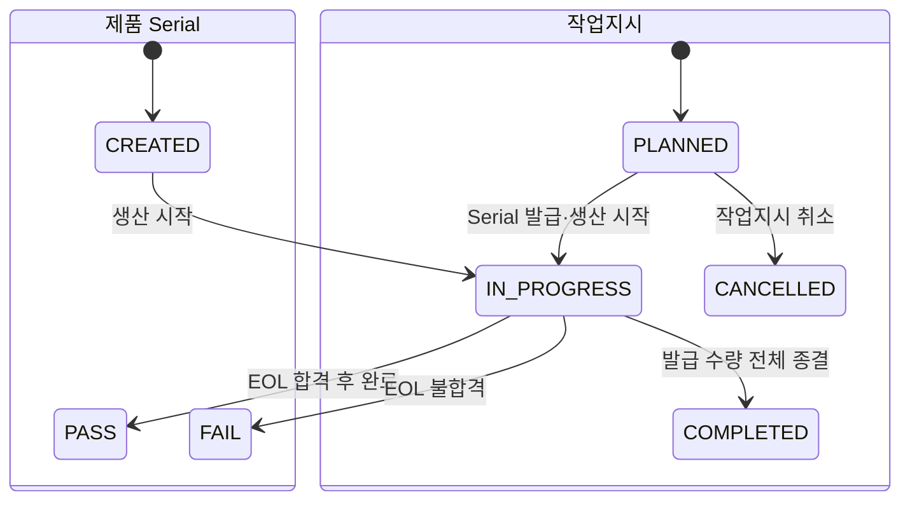
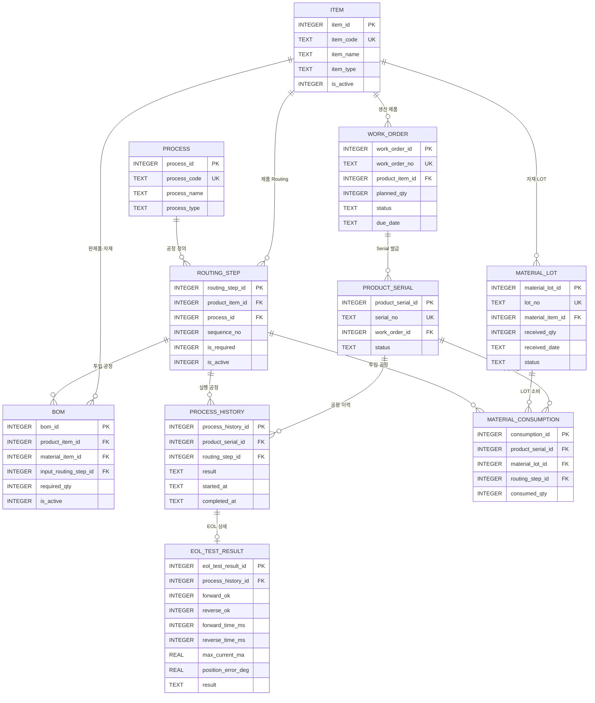

# Actuator Mini MES

전기차 HVAC 에어믹스 도어 액추에이터의 생산 준비부터 공정 실행, EOL 검사, 생산 완료, 양방향 추적까지 연결한 **Python·SQLite·Streamlit 기반 학습용 Mini MES**입니다.

단순 CRUD를 넘어 아래 생산 흐름을 하나의 데이터 모델과 애플리케이션으로 구현합니다.

```text
품목·BOM·Routing → 자재 LOT 입고 → 작업지시·Serial 발급
→ 공정실적·자재 투입 → EOL 검사 → 생산 완료 → 현황·이력 추적
```

> 제품 사양, 공정, 검사 기준과 데이터는 MES 학습을 위해 구성한 가상 정보입니다.

## 주요 기능

| 영역 | 구현 내용 |
|---|---|
| 기준정보 | 완제품·자재 품목, BOM, 표준 공정, 제품별 Routing 조회 |
| 자재관리 | 자재 LOT 입고, 차단·해제, 입고·사용·가용수량 조회 |
| 생산준비 | 작업지시 생성, 계획수량 기반 제품 Serial 일괄 발급 |
| 생산실행 | Serial별 생산 시작, Routing 순서 검증, 공정실적 등록 |
| 자재추적 | 공정별 BOM 자재 LOT 선택 및 실제 소비수량 기록 |
| 품질관리 | 정·역방향 동작, 동작시간, 최대전류, 위치오차 기반 EOL 판정 |
| 생산완료 | EOL 합격 제품 완료 처리, Serial·작업지시 상태 갱신 |
| 생산현황 | 작업지시 진척률, 공정별 WIP, 일별 생산량, PASS·FAIL 집계 |
| 추적성 | Serial 정방향 추적 및 자재 LOT 역방향 추적 |
| 시각화 | Streamlit·Altair 기반 대시보드와 품질 차트 |

## 전체 생산 흐름


```mermaid
flowchart LR
    A["기준정보<br/>품목 · BOM · Routing"] --> B["자재 LOT 입고"]
    B --> C["작업지시 생성"]
    C --> D["제품 Serial 발급"]
    D --> E["Serial 생산 시작"]
    E --> F["공정실적·자재투입"]
    F --> G["EOL 검사"]
    G --> H{"최종 판정"}
    H -->|PASS| I["생산 완료"]
    H -->|FAIL| J["불합격 종료"]
    I --> K["현황·이력 추적"]
    J --> K
```

## 상태 전이


```mermaid
stateDiagram-v2
    state "제품 Serial" as Serial {
        [*] --> CREATED
        CREATED --> IN_PROGRESS: 생산 시작
        IN_PROGRESS --> PASS: EOL 합격 후 완료
        IN_PROGRESS --> FAIL: EOL 불합격
    }

    state "작업지시" as WorkOrder {
        [*] --> PLANNED
        PLANNED --> IN_PROGRESS: Serial 발급·생산 시작
        IN_PROGRESS --> COMPLETED: 발급 수량 전체 종결
        PLANNED --> CANCELLED: 작업지시 취소
    }
```

현재 구현은 계획수량만큼 Serial이 발급되고 모든 Serial이 `PASS` 또는 `FAIL`로 종결되면 작업지시를 `COMPLETED`로 변경합니다.

## 애플리케이션 구성

### 메인 대시보드

`app.py`는 Streamlit 진입점이며 작업지시별 계획 대비 완료수량, PASS·FAIL과 합격률, 공정별 WIP, 최근 7일 생산량, 자재 재고 지표를 표시합니다.

### 화면

| 화면 | 파일 | 역할 |
|---|---|---|
| 메인 대시보드 | `app.py` | 생산·품질·공정·재고 지표 |
| 품목·생산기준 | `pages/01_품목_생산기준_조회.py` | 품목, BOM, Routing 조회 |
| 자재 LOT | `pages/02_자재_LOT_관리.py` | 입고, 가용재고, LOT 상태 관리 |
| 작업지시 | `pages/03_작업지시_관리.py` | 작업지시 생성과 Serial 발급 |
| 공정실적 | `pages/04_공정실적_관리.py` | 다음 공정, 자재 선택, 결과 등록 |
| EOL·완료 | `pages/05_EOL_검사_생산완료.py` | 검사, 판정, 완료, 품질 모니터링 |
| 생산 현황 | `pages/06_생산_현황.py` | 작업지시·Serial·공정 진행 조회 |
| Serial 추적 | `pages/07_Serial_정방향_추적.py` | 제품에서 공정·자재·검사 추적 |
| LOT 추적 | `pages/08_자재_LOT_역방향_추적.py` | LOT에서 영향 제품 추적 |

### 서비스 계층

| 모듈 | 역할 |
|---|---|
| `db.py` | SQLite 연결, 외래키 활성화, 무결성 확인 |
| `ui.py` | 공통 Streamlit UI |
| `master_data_service.py` | 품목·BOM·Routing 조회 |
| `material_lot_service.py` | LOT 입고·차단·재고 집계 |
| `work_order_service.py` | 작업지시 생성·조회, Serial 발급 |
| `process_service.py` | 생산 시작, 실적, 자재소비, EOL, 완료 |
| `process_history_service.py` | 공정 지표와 이력 집계 |
| `eol_service.py` | 전류·동작시간·판정 분석 |
| `production_status_service.py` | 생산 진행상태 조회 |
| `traceability_service.py` | Serial·LOT 양방향 추적 |
| `dashboard_service.py` | 대시보드 집계 |

## 핵심 업무 규칙

- 품목코드, 작업지시번호, LOT 번호, Serial 번호는 고유합니다.
- 계획수량만큼 Serial을 발급하고 제품 Routing 순서대로 필수 공정을 진행합니다.
- 동일한 Serial·공정 실적은 중복 등록할 수 없습니다.
- 제품 BOM에 연결된 자재만 투입하며 LOT 가용수량을 초과할 수 없습니다.
- EOL은 이전 필수 공정이 완료된 Serial에만 등록할 수 있습니다.
- EOL FAIL 제품은 `FAIL`로 종결되고, PASS 제품만 완료 공정을 거쳐 `PASS`가 됩니다.
- 외래키, `UNIQUE`, `CHECK` 제약과 서비스 트랜잭션으로 무결성을 보호합니다.

## 데이터베이스 ERD


```mermaid
erDiagram
    ITEM {
        INTEGER item_id PK
        TEXT item_code UK
        TEXT item_name
        TEXT item_type
        INTEGER is_active
    }
    PROCESS {
        INTEGER process_id PK
        TEXT process_code UK
        TEXT process_name
        TEXT process_type
    }
    ROUTING_STEP {
        INTEGER routing_step_id PK
        INTEGER product_item_id FK
        INTEGER process_id FK
        INTEGER sequence_no
        INTEGER is_required
        INTEGER is_active
    }
    BOM {
        INTEGER bom_id PK
        INTEGER product_item_id FK
        INTEGER material_item_id FK
        INTEGER input_routing_step_id FK
        INTEGER required_qty
        INTEGER is_active
    }
    MATERIAL_LOT {
        INTEGER material_lot_id PK
        TEXT lot_no UK
        INTEGER material_item_id FK
        INTEGER received_qty
        TEXT received_date
        TEXT status
    }
    WORK_ORDER {
        INTEGER work_order_id PK
        TEXT work_order_no UK
        INTEGER product_item_id FK
        INTEGER planned_qty
        TEXT status
        TEXT due_date
    }
    PRODUCT_SERIAL {
        INTEGER product_serial_id PK
        TEXT serial_no UK
        INTEGER work_order_id FK
        TEXT status
    }
    PROCESS_HISTORY {
        INTEGER process_history_id PK
        INTEGER product_serial_id FK
        INTEGER routing_step_id FK
        TEXT result
        TEXT started_at
        TEXT completed_at
    }
    MATERIAL_CONSUMPTION {
        INTEGER consumption_id PK
        INTEGER product_serial_id FK
        INTEGER material_lot_id FK
        INTEGER routing_step_id FK
        INTEGER consumed_qty
    }
    EOL_TEST_RESULT {
        INTEGER eol_test_result_id PK
        INTEGER process_history_id FK
        INTEGER forward_ok
        INTEGER reverse_ok
        INTEGER forward_time_ms
        INTEGER reverse_time_ms
        REAL max_current_ma
        REAL position_error_deg
        TEXT result
    }

    ITEM ||--o{ ROUTING_STEP : "제품 Routing"
    PROCESS ||--o{ ROUTING_STEP : "공정 정의"
    ITEM ||--o{ BOM : "완제품·자재"
    ROUTING_STEP ||--o{ BOM : "투입 공정"
    ITEM ||--o{ MATERIAL_LOT : "자재 LOT"
    ITEM ||--o{ WORK_ORDER : "생산 제품"
    WORK_ORDER ||--o{ PRODUCT_SERIAL : "Serial 발급"
    PRODUCT_SERIAL ||--o{ PROCESS_HISTORY : "공정 이력"
    ROUTING_STEP ||--o{ PROCESS_HISTORY : "실행 공정"
    PRODUCT_SERIAL ||--o{ MATERIAL_CONSUMPTION : "자재 사용"
    MATERIAL_LOT ||--o{ MATERIAL_CONSUMPTION : "LOT 소비"
    ROUTING_STEP ||--o{ MATERIAL_CONSUMPTION : "투입 공정"
    PROCESS_HISTORY ||--o| EOL_TEST_RESULT : "EOL 상세"
```

### 추적 관계

```text
작업지시
└── 제품 Serial
    ├── 공정실적
    │   └── EOL 검사 결과
    └── 자재 소비
        └── 자재 LOT
```

- 정방향 추적: Serial → 작업지시 → 공정실적 → 투입 LOT → EOL
- 역방향 추적: 자재 LOT → 소비이력 → 영향 Serial → 작업지시·품질

## 프로젝트 구조

```text
actuator-mini-mes/
├── app.py
├── README.md
├── requirements.md
├── pytest.ini
├── pages/                 # Streamlit 업무 화면 8개
├── src/                   # DB·UI·업무 서비스
├── sql/
│   ├── schema.sql
│   ├── seed.sql
│   └── mes_dev.db
└── test/
    ├── conftest.py
    ├── test_database.py
    └── test_production_integration.py
```

## 기술 스택

| 영역 | 기술 |
|---|---|
| Language | Python |
| UI | Streamlit |
| Database | SQLite |
| Data | pandas |
| Visualization | Altair |
| Test | pytest |

## 실행 방법

```bash
cd "Mini MES Project/actuator-mini-mes"
python -m venv .venv
```

Windows PowerShell:

```powershell
.\.venv\Scripts\Activate.ps1
pip install streamlit pandas altair pytest
streamlit run app.py
```

macOS·Linux:

```bash
source .venv/bin/activate
pip install streamlit pandas altair pytest
streamlit run app.py
```

`src/db.py`는 `sql/mes_dev.db`를 기본 데이터베이스로 사용하고 연결 시 SQLite 외래키 제약을 활성화합니다.

## 테스트

```bash
pytest
```

테스트는 원본 DB를 임시 디렉터리로 복사하고 서비스 DB 경로를 교체하여 원본 데이터를 보호합니다.

> `pytest.ini`의 `testpaths`와 실제 테스트 폴더 이름이 일치하는지 확인해야 합니다.

## 현재 범위와 향후 개선

현재는 로컬 단일 사용자 학습 애플리케이션입니다. 로그인·권한, 재작업·재검사, 실시간 설비 연동, ERP 연동, BOM·Routing 버전 관리, 다중 사용자 서버 배포는 제외합니다.

향후에는 요구사항과 구현 규칙 동기화, 최신 서비스 기준 테스트 정리, GitHub Actions, EOL 기준 설정화, 재작업 흐름, 인증·감사 로그, 서버형 DB 확장을 진행할 수 있습니다.
