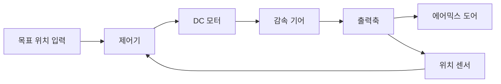
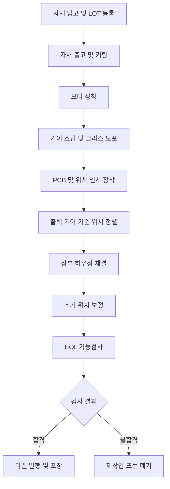
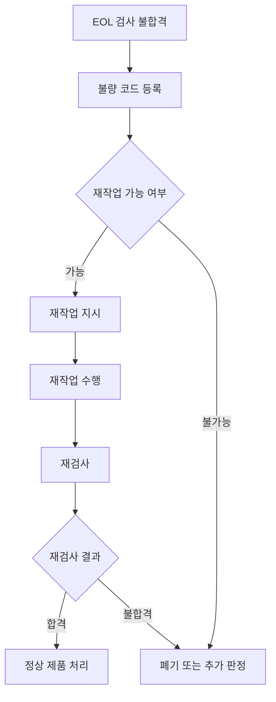

# 자동차 HVAC 액추에이터 Mini MES 프로젝트

> **자동차 HVAC 에어믹스 도어 액추에이터의 조립·검사 공정을 관리하는 Mini MES 구축 프로젝트**

---

## 📌 프로젝트 개요

이 프로젝트는 자동차에 사용되는 **소형 전동 액추에이터**의 생산 과정을 가상으로 구성하고, 이를 관리하는 **Mini MES(Manufacturing Execution System)**를 직접 구현하는 것을 목표로 한다.

구체적인 생산 대상은 다음과 같다.

> **자동차 HVAC 에어믹스 도어 액추에이터**
> Automotive HVAC Air Mix Door Actuator

이 액추에이터는 자동차 실내 공조 시스템에서 차가운 공기와 따뜻한 공기가 섞이는 비율을 조절하는 플랩을 움직인다.

프로젝트에서는 다음 전체 흐름을 구현한다.

```text
생산 작업지시 생성
        ↓
부품 LOT 투입
        ↓
액추에이터 조립
        ↓
공정별 생산실적 기록
        ↓
EOL 기능검사
        ↓
합격·불합격 판정
        ↓
완제품 Serial 발행
        ↓
생산이력 및 LOT 추적
```

---

## 🎯 프로젝트 목표

이 프로젝트의 핵심 목표는 단순한 생산관리 웹사이트를 만드는 것이 아니다.

자동차 부품이 실제 제조 현장에서 어떤 구조로 생산되고, 어떤 데이터가 생성되며, MES가 그 데이터를 어떻게 관리하는지를 학습하는 것이 목적이다.

### 주요 학습 목표

* 자동차용 소형 전동 액추에이터의 구조 이해
* 제품 BOM과 부품 LOT 관리 이해
* 제조공정과 Routing 이해
* 작업지시와 생산실적 관리
* 공정별 재공품 관리
* 제품 Serial Number 관리
* 품질검사 및 불량 코드 관리
* 부품 LOT와 완제품 간 추적성 확보
* 설비 데이터 수집 구조 이해
* 제조 데이터 분석 및 AI 확장 기반 마련

---

# 1. 프로젝트 도메인 정의

## 1.1 생산 제품

| 구분     | 내용                         |
| ------ | -------------------------- |
| 제품명    | HVAC Air Mix Door Actuator |
| 한글명    | 자동차 HVAC 에어믹스 도어 액추에이터     |
| 제품코드   | `HVA-ACT-001`              |
| 적용 분야  | 자동차 실내 공조 시스템              |
| 구동 방식  | 12V 브러시 DC 모터              |
| 감속 방식  | 다단 평기어 감속                  |
| 출력 운동  | 제한된 각도의 회전운동               |
| 위치 측정  | 가변저항식 위치 센서                |
| 부품 추적  | LOT 단위                     |
| 완제품 추적 | Serial Number 단위           |
| 최종검사   | 방향, 이동시간, 위치, 전류           |
| 생산라인   | 1개 가상 생산라인                 |

> [!NOTE]
> 이 프로젝트의 제품 사양과 검사 기준은 실제 특정 기업의 제품을 복제한 것이 아니라, MES 학습을 위해 현실적인 수준으로 단순화한 가상 사양이다.

---

## 1.2 HVAC란?

HVAC는 다음 단어의 약자다.

| 약어 | 의미                        |
| -- | ------------------------- |
| H  | Heating, 난방               |
| V  | Ventilation, 환기           |
| AC | Air Conditioning, 냉방 및 공조 |

자동차 HVAC 시스템은 차량 내부의 다음 요소를 조절한다.

* 실내 온도
* 바람의 세기
* 바람이 나오는 위치
* 외기 및 내기순환
* 운전석과 조수석의 개별 온도
* 앞유리 김 서림 제거

자동차 대시보드 내부에는 공기가 이동하는 통로와 여러 개의 플랩 또는 도어가 존재한다.

이 도어를 움직이는 장치가 바로 **HVAC 액추에이터**다.

---

# 2. 액추에이터란?

## 2.1 액추에이터의 기본 개념

액추에이터는 전기적 명령을 받아 실제 기계적인 움직임을 만들어내는 장치다.

```text
전기 신호
   ↓
모터 회전
   ↓
기어 감속
   ↓
출력축 회전
   ↓
플랩·도어·밸브 이동
```

쉽게 구분하면 다음과 같다.

| 장치    | 역할                    |
| ----- | --------------------- |
| 센서    | 현재 상태를 감지한다           |
| 제어기   | 어떤 동작을 수행할지 판단한다      |
| 액추에이터 | 판단 결과에 따라 실제 물체를 움직인다 |

예를 들어 차량의 공조 온도를 22℃에서 25℃로 변경하면 다음 과정이 발생한다.

```text
운전자 온도 변경
      ↓
HVAC 제어기가 목표 위치 계산
      ↓
액추에이터에 구동 명령 전달
      ↓
모터가 회전
      ↓
기어와 출력축이 플랩 이동
      ↓
따뜻한 공기의 혼합 비율 증가
```

---

## 2.2 모터와 액추에이터의 차이

모터와 액추에이터는 동일한 장치가 아니다.

모터는 액추에이터를 구성하는 핵심 부품 중 하나다.

```text
액추에이터
├── 모터
├── 감속 기어
├── 출력축
├── 위치 센서
├── PCB 또는 전기 회로
├── 커넥터
└── 하우징
```

| 구분    | 설명                  |
| ----- | ------------------- |
| 모터    | 전기에너지를 회전운동으로 변환    |
| 감속기   | 회전속도를 낮추고 토크를 증가    |
| 위치 센서 | 현재 출력축의 위치를 측정      |
| 제어회로  | 모터의 방향과 동작을 제어      |
| 하우징   | 내부 부품을 고정하고 보호      |
| 액추에이터 | 위 부품들이 결합된 완성 기능 모듈 |

즉, 다음과 같은 관계로 이해할 수 있다.

```text
모터는 액추에이터의 구성 부품이다.
```

---

# 3. 에어믹스 도어 액추에이터

## 3.1 에어믹스 도어의 역할

에어믹스 도어는 차가운 공기와 따뜻한 공기가 섞이는 비율을 조절한다.

프로젝트에서는 액추에이터의 출력축이 약 0도에서 90도 사이를 회전한다고 가정한다.

| 출력축 위치 | 공조 상태             |
| -----: | ----------------- |
|     0도 | 차가운 공기 비율이 높음     |
|    45도 | 차가운 공기와 따뜻한 공기 혼합 |
|    90도 | 따뜻한 공기 비율이 높음     |

> [!IMPORTANT]
> 실제 액추에이터의 회전 범위와 제어 방식은 차량 및 제품 설계에 따라 다르다.
> 0~90도 범위는 프로젝트 구현을 위한 가상 기준이다.

---

## 3.2 자동차 HVAC 도어 종류

자동차 HVAC 시스템에는 여러 종류의 도어가 존재한다.

| 도어 종류   | 주요 기능                 |
| ------- | --------------------- |
| 에어믹스 도어 | 냉풍과 온풍의 혼합 비율 조절      |
| 모드 도어   | 얼굴, 발, 앞유리 등 바람 방향 선택 |
| 인테이크 도어 | 외기 유입과 내기순환 선택        |
| 듀얼존 도어  | 운전석과 조수석 온도를 개별 조절    |

이번 프로젝트에서는 이 중 **에어믹스 도어 액추에이터**만 생산 대상으로 설정한다.

---

# 4. 액추에이터의 내부 구성

## 4.1 DC 모터

DC 모터는 액추에이터의 동력원이다.

전압을 인가하면 회전하며, 전원의 극성을 바꾸면 반대 방향으로 회전할 수 있다.

```text
정방향 전압 인가 → 시계 방향 회전
역방향 전압 인가 → 반시계 방향 회전
```

이번 프로젝트에서는 이해와 구현이 비교적 쉬운 **12V 브러시 DC 모터**를 사용한다고 가정한다.

---

## 4.2 감속기와 기어

소형 DC 모터는 빠르게 회전하지만 출력 토크는 상대적으로 작다.

하지만 에어믹스 도어는 빠른 속도보다 천천히 안정적으로 움직이는 힘이 필요하다.

따라서 여러 개의 기어를 사용해 회전속도를 낮추고 토크를 높인다.

```text
모터

빠른 회전
작은 토크
    ↓
다단 기어 감속
    ↓
느린 회전
큰 토크
```

예를 들어 감속비가 100:1이라면, 이상적인 조건에서 모터가 약 100회 회전할 때 출력축은 약 1회 회전한다.

실제 출력은 기어 마찰과 기계적 손실의 영향을 받는다.

---

## 4.3 출력 기어와 출력축

모터의 회전은 여러 개의 기어를 거쳐 마지막 출력 기어로 전달된다.

```text
모터축
  ↓
피니언 기어
  ↓
중간 기어 A
  ↓
중간 기어 B
  ↓
출력 기어
  ↓
출력축
  ↓
에어믹스 도어
```

출력축은 자동차 HVAC 도어와 직접 연결되어 도어의 위치를 변경한다.

---

## 4.4 위치 센서

액추에이터는 출력축이 현재 어느 위치에 있는지 알아야 한다.

이를 위해 위치 센서를 사용한다.

대표적인 센서 방식은 다음과 같다.

| 센서 방식    | 특징                       |
| -------- | ------------------------ |
| 가변저항식 센서 | 위치에 따라 출력 전압이 달라짐        |
| 홀 센서     | 자석과 자기장을 이용해 위치 측정       |
| 엔코더      | 회전량이나 절대 위치를 디지털 방식으로 측정 |

이번 프로젝트에서는 구조가 단순한 **가변저항식 위치 센서**를 사용한다고 가정한다.

### 가상 센서 출력 예시

| 출력축 위치 | 센서 출력 전압 |
| -----: | -------: |
|     0도 |     0.5V |
|    45도 |     2.5V |
|    90도 |     4.5V |

이 값을 이용하면 다음과 같이 현재 위치를 추정할 수 있다.

```text
센서 전압 측정
      ↓
각도 값으로 변환
      ↓
목표 위치와 현재 위치 비교
      ↓
모터 계속 구동 또는 정지
```

---

## 4.5 PCB와 커넥터

PCB는 제품 설계에 따라 다음 기능을 수행할 수 있다.

* 위치 센서 신호 처리
* 모터 구동
* 전원 공급
* 이상 상태 진단
* 차량 제어기와 통신
* 모터 과전류 보호

일부 액추에이터는 LIN 또는 CAN 통신을 사용할 수 있지만, 프로젝트 1차 버전에서는 통신 기능을 단순화한다.

### 1차 버전에서 관리할 신호

```text
모터 정방향 구동 신호
모터 역방향 구동 신호
위치 센서 전압
모터 소비전류
```

---

## 4.6 하우징

하우징은 모터, 기어, 센서, PCB 등을 내부에 고정하고 보호한다.

프로젝트에서는 다음 부품으로 나눈다.

* 하부 하우징
* 상부 하우징
* 체결 나사
* 실링 또는 패킹 부품
* 기어 윤활용 그리스

---

# 5. 프로젝트용 BOM

BOM은 `Bill of Materials`의 약자로, 제품 하나를 생산하는 데 필요한 부품과 수량을 정의한 목록이다.

## 5.1 완제품 BOM

| 자재 코드            | 자재명       |  수량 | 관리 방식 |
| ---------------- | --------- | --: | ----- |
| `MAT-MOTOR-001`  | 12V DC 모터 |   1 | LOT   |
| `MAT-GEAR-001`   | 모터 피니언 기어 |   1 | LOT   |
| `MAT-GEAR-002`   | 중간 기어 A   |   1 | LOT   |
| `MAT-GEAR-003`   | 중간 기어 B   |   1 | LOT   |
| `MAT-GEAR-004`   | 출력 기어     |   1 | LOT   |
| `MAT-SENSOR-001` | 위치 센서     |   1 | LOT   |
| `MAT-PCB-001`    | 제어 PCB    |   1 | LOT   |
| `MAT-HOUSING-L`  | 하부 하우징    |   1 | LOT   |
| `MAT-HOUSING-U`  | 상부 하우징    |   1 | LOT   |
| `MAT-SCREW-001`  | 체결 나사     |   3 | LOT   |
| `MAT-GREASE-001` | 기어 윤활 그리스 | 규정량 | LOT   |
| `MAT-LABEL-001`  | 제품 라벨     |   1 | LOT   |

---

## 5.2 부품과 완제품의 추적 단위

부품은 여러 개를 묶은 **LOT 단위**로 관리한다.

```text
모터 LOT: MT-20260718-A
기어 LOT: GR-20260717-B
PCB LOT: PCB-20260716-C
센서 LOT: SEN-20260715-A
```

완성된 액추에이터에는 개별 **Serial Number**를 부여한다.

```text
HVA-20260718-000001
HVA-20260718-000002
HVA-20260718-000003
```

정리하면 다음과 같다.

| 대상              | 추적 방식         |
| --------------- | ------------- |
| 모터, 기어, PCB, 센서 | LOT           |
| 완제품 액추에이터       | Serial Number |
| 생산 작업           | 작업지시번호        |
| 설비              | 설비 코드         |
| 작업자             | 작업자 코드        |

---

# 6. 액추에이터 동작 원리

## 6.1 전체 동작 흐름

액추에이터는 목표 위치와 현재 위치를 비교하면서 동작한다.



이처럼 출력 결과를 다시 측정해 제어기에 전달하는 구조를 **피드백 제어** 또는 **폐루프 제어**라고 한다.

---

## 6.2 동작 예시

현재 위치가 20도이고 목표 위치가 60도라고 가정한다.

```text
현재 위치: 20도
목표 위치: 60도
```

### 1단계: 이동 방향 결정

```text
목표 위치 > 현재 위치
→ 정방향 이동 필요
```

### 2단계: 모터 구동

```text
제어기
  ↓
정방향 구동 신호 출력
  ↓
DC 모터 회전
```

### 3단계: 기어 감속

모터의 빠른 회전이 다단 기어를 통과하며 느리고 강한 회전으로 변환된다.

### 4단계: 출력축 이동

출력축이 에어믹스 도어를 목표 방향으로 이동시킨다.

### 5단계: 위치 확인

```text
현재 위치 30도
현재 위치 40도
현재 위치 50도
현재 위치 58도
현재 위치 60도
```

### 6단계: 모터 정지

```text
현재 위치 = 목표 위치
→ 모터 구동 정지
```

---

# 7. 자동차에서 사용되는 전동 액추에이터

자동차에는 HVAC 이외에도 다양한 전동 액추에이터가 사용된다.

## 7.1 차체 및 편의장치

* 파워윈도
* 전동 시트
* 도어 잠금장치
* 전동 트렁크
* 충전구 잠금장치
* 헤드램프 높이 조절
* 사이드미러 조절
* HVAC 플랩 조절

## 7.2 열관리 장치

* 냉각수 제어 밸브
* 배터리 열관리 밸브
* 전기차 다방향 밸브
* 액티브 그릴 셔터
* 오일 흐름 제어장치

## 7.3 파워트레인 및 변속장치

* 스로틀 액추에이터
* EGR 밸브 액추에이터
* 터보차저 액추에이터
* 클러치 액추에이터
* 변속 액추에이터
* 주차 잠금장치 액추에이터

제동, 조향, 변속과 관련된 액추에이터는 높은 안전성과 정밀성이 요구된다.

따라서 첫 Mini MES 프로젝트에서는 비교적 구조를 이해하기 쉬운 HVAC 액추에이터를 선택한다.

---

# 8. 가상 제조공정

이번 프로젝트에서는 액추에이터 제조공정을 다음과 같이 구성한다.



---

## 8.1 OP10 자재 입고 및 LOT 등록

공급업체에서 입고된 부품을 등록한다.

### 관리 데이터 예시

```text
자재 코드: MAT-MOTOR-001
자재명: 12V DC 모터
공급업체: SUP-MOTOR-01
공급 LOT: MT-20260718-A
입고수량: 1,000개
입고일자: 2026-07-18
수입검사 결과: PASS
```

### 주요 관리 항목

* 자재 코드
* 자재명
* 공급업체
* 공급 LOT
* 입고수량
* 검사결과
* 보관 위치
* 사용 가능 여부

---

## 8.2 OP20 자재 출고 및 키팅

생산 작업지시에 필요한 자재를 창고에서 출고한다.

키팅은 제품 생산에 필요한 부품을 작업 단위별로 준비하는 과정이다.

### 관리 항목

* 작업지시번호
* 출고 자재
* 출고 LOT
* 출고수량
* 출고 작업자
* 출고 시간
* 투입 생산라인

---

## 8.3 OP30 모터 장착

하부 하우징에 DC 모터를 장착한다.

### 확인 항목

* 모터가 누락되지 않았는가
* 올바른 모터가 투입되었는가
* 장착 방향이 올바른가
* 모터 LOT가 등록되었는가
* 모터가 하우징에 정상적으로 고정되었는가

### MES 기록 데이터

```text
작업지시번호
완제품 임시 Serial
모터 LOT
작업자
설비
작업 시작 시간
작업 종료 시간
작업 결과
```

---

## 8.4 OP40 기어 조립 및 그리스 도포

피니언 기어, 중간 기어, 출력 기어를 조립하고 윤활 그리스를 도포한다.

### 확인 항목

* 기어 종류가 올바른가
* 기어 수량이 맞는가
* 기어의 앞뒤 방향이 올바른가
* 기어가 정상적으로 맞물리는가
* 그리스가 규정량만큼 도포되었는가
* 조립 후 기어가 원활하게 회전하는가

### 예상 불량

* 기어 누락
* 잘못된 기어 투입
* 기어 역조립
* 기어 치형 파손
* 그리스 부족
* 그리스 과다
* 이물질 혼입

---

## 8.5 OP50 PCB 및 위치 센서 장착

PCB와 위치 센서를 하우징에 설치한다.

### 확인 항목

* PCB 종류가 올바른가
* 위치 센서가 기준 위치에 장착되었는가
* 커넥터가 정상적으로 결합되었는가
* PCB 및 센서 LOT가 등록되었는가
* 센서 출력이 정상적으로 측정되는가

---

## 8.6 OP60 출력 기어 기준 위치 정렬

출력 기어와 위치 센서의 기준 위치를 맞춘다.

출력축의 실제 위치와 센서 출력값이 일치하지 않으면, 제어기가 잘못된 위치로 판단할 수 있다.

### 가상 기준 예시

```text
기준 출력 위치: 0도
센서 기준 범위: 0.45~0.55V
측정값: 0.51V
판정: PASS
```

---

## 8.7 OP70 상부 하우징 체결

상부 하우징을 덮고 나사를 체결한다.

### 확인 항목

* 상부 하우징이 정확히 조립되었는가
* 나사가 누락되지 않았는가
* 체결 토크가 기준 범위에 들어오는가
* 하우징에 들뜸이 없는가
* 하우징이 파손되지 않았는가

### 체결 데이터 예시

| 체결 위치 |    측정 토크 | 판정   |
| ----- | -------: | ---- |
| 나사 1  | 0.62 N·m | PASS |
| 나사 2  | 0.59 N·m | PASS |
| 나사 3  | 0.61 N·m | PASS |

> [!NOTE]
> 체결 토크값은 프로젝트용 가상 기준이며, 실제 제품 사양이 아니다.

---

## 8.8 OP80 초기 위치 보정

완제품 조립 후 센서 출력과 출력축의 실제 위치를 다시 확인한다.

필요한 경우 기준 위치를 보정한다.

### 관리 항목

* 기준 위치
* 센서 측정값
* 보정 전 오차
* 보정 후 오차
* 보정 결과
* 작업자 또는 보정 설비

---

## 8.9 OP90 EOL 기능검사

EOL은 `End of Line`의 약자다.

생산라인 마지막에서 완성된 제품의 기능을 검사하는 공정이다.

이번 프로젝트에서 가장 중요한 공정 중 하나다.

---

## 8.10 OP100 라벨 발행 및 포장

EOL 검사에 합격한 제품에 최종 Serial Number 라벨을 부착하고 포장한다.

### 라벨 정보 예시

```text
제품명: HVAC Air Mix Door Actuator
제품코드: HVA-ACT-001
Serial: HVA-20260718-000125
생산일자: 2026-07-18
검사결과: PASS
```

---

# 9. EOL 검사 항목

## 9.1 전체 검사 항목

| 검사항목   | 확인 목적                |
| ------ | -------------------- |
| 정방향 동작 | 지정된 방향으로 정상 이동하는지 확인 |
| 역방향 동작 | 반대 방향으로 정상 복귀하는지 확인  |
| 이동 각도  | 요구된 위치까지 이동하는지 확인    |
| 동작시간   | 지나치게 느리거나 빠르지 않은지 확인 |
| 위치 오차  | 목표 위치와 실제 위치 비교      |
| 소비전류   | 마찰, 끼임, 모터 이상 확인     |
| 출력 토크  | 플랩을 움직일 힘이 충분한지 확인   |
| 소음·진동  | 기어 또는 조립 이상 확인       |
| 센서 출력  | 위치 신호가 정상적인지 확인      |
| 전기 연결  | 전원과 커넥터 연결 상태 확인     |

---

## 9.2 Mini MES 1차 구현 항목

첫 번째 버전에서는 다음 네 가지 검사를 우선 구현한다.

1. 동작 방향
2. 이동시간
3. 최종 위치 오차
4. 평균 및 최대 소비전류

### 가상 품질 기준 예시

| 검사항목     |   하한 |   상한 | 단위 |
| -------- | ---: | ---: | -- |
| 이동시간     |  1.5 |  3.0 | 초  |
| 최종 위치 오차 | -2.0 |  2.0 | 도  |
| 평균 소비전류  | 0.10 | 0.60 | A  |
| 최대 소비전류  | 0.10 | 1.20 | A  |

> [!WARNING]
> 위 검사 범위는 시스템 구현을 위한 가상 데이터다. 실제 제품 개발이나 품질판정에는 사용할 수 없다.

---

# 10. 전류 데이터와 제품 상태

모터 소비전류는 모터가 얼마나 많은 부하를 받고 있는지를 간접적으로 나타낸다.

## 10.1 정상 전류 흐름

```text
모터 시작
   ↓
시작 전류 일시 증가
   ↓
이동 중 비교적 일정한 전류
   ↓
목표 위치 도달
   ↓
모터 정지 및 전류 감소
```

## 10.2 비정상 전류 흐름

기어 조립 불량이나 내부 마찰이 발생하면 전류가 비정상적으로 증가할 수 있다.

```text
정상 상태

─────── 일정한 전류 ───────


이상 상태

───▲────▲──▲────▲──
   불규칙한 전류 상승
```

## 10.3 전류로 추정할 수 있는 이상

* 기어 끼임
* 내부 마찰 증가
* 하우징 간섭
* 출력축 구속
* 그리스 부족
* 모터 이상
* 기어 치형 파손

전류 데이터만으로 정확한 불량 원인을 확정할 수는 없다.

따라서 위치, 이동시간, 소음, 진동 등의 데이터와 함께 판단해야 한다.

---

# 11. 예상 불량 유형

| 불량 유형    | 예상 현상                  | 관련 측정 데이터  |
| -------- | ---------------------- | ---------- |
| 모터 누락    | 제품이 전혀 움직이지 않음         | 전류, 위치     |
| 모터 방향 오류 | 반대 방향으로 움직임            | 이동 방향, 위치  |
| 기어 누락    | 모터는 회전하지만 출력축이 움직이지 않음 | 전류, 위치     |
| 기어 치형 파손 | 반복적인 걸림과 소음 발생         | 전류, 진동     |
| 기어 오조립   | 느린 동작 또는 중간 정지         | 시간, 전류, 위치 |
| 그리스 부족   | 마찰, 전류, 소음 증가          | 전류, 진동     |
| 그리스 과다   | 동작 저항 또는 내부 오염         | 전류, 외관     |
| 센서 위치 오류 | 실제 위치와 센서값 불일치         | 위치 오차      |
| PCB 불량   | 신호 없음 또는 불안정           | 전압, 통신     |
| 커넥터 불량   | 간헐적인 전원 또는 신호 단절       | 전기검사       |
| 나사 누락    | 하우징 유격 및 소음 발생         | 체결 결과      |
| 하우징 파손   | 기어 정렬 불량 또는 외관 이상      | 외관, 전류     |

---

## 11.1 불량 코드 예시

| 불량 코드  | 불량명                    |
| ------ | ---------------------- |
| `D001` | `MOTOR_MISSING`        |
| `D002` | `MOTOR_REVERSE`        |
| `D003` | `GEAR_MISSING`         |
| `D004` | `GEAR_DAMAGE`          |
| `D005` | `GEAR_MISASSEMBLY`     |
| `D006` | `GREASE_SHORTAGE`      |
| `D007` | `GREASE_EXCESS`        |
| `D008` | `SENSOR_OFFSET`        |
| `D009` | `PCB_FAILURE`          |
| `D010` | `CONNECTOR_FAILURE`    |
| `D011` | `SCREW_MISSING`        |
| `D012` | `HOUSING_DAMAGE`       |
| `D013` | `CURRENT_HIGH`         |
| `D014` | `POSITION_ERROR`       |
| `D015` | `OPERATING_TIME_ERROR` |

---

# 12. 불량품 처리 흐름

EOL 검사에서 불합격한 제품은 바로 폐기하는 것이 아니라, 불량 유형과 수리 가능 여부를 판단한다.



### MES에서 기록할 정보

* 최초 불량 코드
* 최초 검사 결과
* 불량 발생 공정
* 재작업 지시번호
* 재작업 내용
* 재작업 작업자
* 재검사 결과
* 최종 판정
* 폐기 여부

---

# 13. 제품 Routing

Routing은 제품이 생산되면서 거쳐야 하는 표준 공정 순서를 의미한다.

| 공정 코드   | 공정명            |
| ------- | -------------- |
| `OP10`  | 자재 입고 및 LOT 등록 |
| `OP20`  | 자재 출고 및 키팅     |
| `OP30`  | 모터 장착          |
| `OP40`  | 기어 조립 및 그리스 도포 |
| `OP50`  | PCB 및 위치 센서 장착 |
| `OP60`  | 출력 기어 기준 위치 정렬 |
| `OP70`  | 상부 하우징 체결      |
| `OP80`  | 초기 위치 보정       |
| `OP90`  | EOL 기능검사       |
| `OP100` | 라벨 발행 및 포장     |

Mini MES에서는 제품이 현재 어느 공정에 있는지를 관리해야 한다.

```text
HVA-20260718-000125

현재 공정: OP50
이전 공정: OP40 완료
다음 공정: OP60 대기
제품 상태: WIP
```

---

# 14. 작업지시

작업지시는 특정 제품을 일정 수량만큼 생산하도록 현장에 전달하는 명령이다.

## 14.1 작업지시 예시

```text
작업지시번호: WO-20260718-001
제품코드: HVA-ACT-001
제품명: HVAC Air Mix Door Actuator
계획수량: 100개
생산라인: LINE-01
계획 시작일: 2026-07-18
계획 종료일: 2026-07-18
상태: RELEASED
```

## 14.2 작업지시 상태

| 상태            | 설명       |
| ------------- | -------- |
| `CREATED`     | 작업지시 생성  |
| `RELEASED`    | 현장 작업 가능 |
| `IN_PROGRESS` | 생산 진행 중  |
| `PAUSED`      | 생산 일시 중지 |
| `COMPLETED`   | 생산 완료    |
| `CANCELLED`   | 작업지시 취소  |

---

# 15. 생산실적과 WIP

## 15.1 생산실적

생산실적은 실제로 생산된 수량과 결과를 의미한다.

```text
계획수량: 100개
투입수량: 100개
완료수량: 96개
양품수량: 94개
불량수량: 2개
재공수량: 4개
```

## 15.2 WIP

WIP는 `Work In Process`의 약자로, 아직 완성되지 않고 생산공정 중에 있는 제품을 의미한다.

```text
모터 조립 대기: 5개
기어 조립 중: 3개
하우징 체결 대기: 2개
EOL 검사 대기: 4개
```

MES는 각 제품이 어느 공정에 위치해 있는지를 추적할 수 있어야 한다.

---

# 16. 제품 Genealogy와 추적성

제품 Genealogy는 완제품에 어떤 부품이 사용되었고, 어떤 공정과 설비를 거쳤는지를 연결한 생산 계보를 의미한다.

## 16.1 완제품 기준 정방향 추적

특정 완제품을 조회했을 때 다음 정보가 나타나야 한다.

```text
Serial: HVA-20260718-000125

작업지시
└── WO-20260718-001

사용 자재
├── 모터 LOT: MT-20260718-A
├── 기어 LOT: GR-20260717-B
├── PCB LOT: PCB-20260716-C
├── 센서 LOT: SEN-20260715-A
└── 하우징 LOT: HS-20260718-D

생산이력
├── 모터 조립
│   ├── 설비: ASM-01
│   ├── 작업자: OP003
│   └── 완료시간: 09:12
│
├── 기어 조립
│   ├── 설비: ASM-02
│   ├── 작업자: OP005
│   └── 완료시간: 09:14
│
├── 하우징 체결
│   ├── 설비: SCREW-01
│   └── 완료시간: 09:17
│
└── EOL 검사
    ├── 설비: TEST-01
    ├── 검사결과: PASS
    └── 완료시간: 09:20
```

---

## 16.2 부품 LOT 기준 역추적

특정 모터 LOT에서 문제가 발견되었다고 가정한다.

```text
문제 모터 LOT
MT-20260718-A
       ↓
해당 LOT가 사용된 완제품 검색
       ↓
HVA-20260718-000101
HVA-20260718-000102
HVA-20260718-000125
HVA-20260718-000131
```

이 기능을 통해 문제가 있는 부품이 사용된 제품만 선별할 수 있다.

---

# 17. Mini MES에서 필요한 핵심 데이터

## 17.1 기준정보

| 데이터     | 설명            |
| ------- | ------------- |
| 제품 마스터  | 생산 제품 정보      |
| 자재 마스터  | 투입 부품 정보      |
| BOM     | 제품별 필요 자재와 수량 |
| Routing | 제품별 표준 공정 순서  |
| 공정 마스터  | 공정 코드와 공정명    |
| 설비 마스터  | 생산 및 검사 설비    |
| 작업자 마스터 | 작업자 계정과 역할    |
| 불량 코드   | 표준 불량 유형      |
| 검사 기준   | 품질검사 상한과 하한   |

## 17.2 생산정보

| 데이터        | 설명              |
| ---------- | --------------- |
| 생산계획       | 일정 기간의 생산 목표    |
| 작업지시       | 현장에 전달되는 생산 명령  |
| 생산실적       | 실제 완료된 생산량      |
| 공정실적       | 각 공정의 시작과 완료 기록 |
| WIP        | 공정 중인 제품        |
| 자재 투입      | 제품별 사용 부품 LOT   |
| 완제품 Serial | 개별 제품 식별번호      |

## 17.3 품질정보

| 데이터    | 설명           |
| ------ | ------------ |
| 검사 결과  | 항목별 측정값과 판정  |
| 최종 판정  | PASS 또는 FAIL |
| 불량 코드  | 발생한 불량 유형    |
| 재작업 이력 | 수리와 재검사 기록   |
| 폐기 이력  | 폐기 사유와 수량    |

## 17.4 설비정보

| 데이터    | 설명                     |
| ------ | ---------------------- |
| 설비 상태  | RUN, IDLE, STOP, ALARM |
| 가동시간   | 실제 생산 중인 시간            |
| 정지시간   | 설비가 멈춘 시간              |
| 알람     | 이상 발생 내용               |
| 측정 데이터 | 전류, 위치, 체결 토크 등        |

---

# 18. 설비 상태 정의

| 상태            | 설명       |
| ------------- | -------- |
| `RUN`         | 정상 가동 중  |
| `IDLE`        | 작업 대기 중  |
| `STOP`        | 생산 정지    |
| `ALARM`       | 설비 이상 발생 |
| `MAINTENANCE` | 정비 중     |

### 설비 이벤트 예시

```text
10:00:00 RUN
10:25:14 ALARM
10:25:20 STOP
10:40:00 MAINTENANCE
10:55:12 IDLE
11:00:00 RUN
```

이 데이터를 이용해 설비 가동시간, 비가동시간, 알람 횟수 등을 계산할 수 있다.

---

# 19. Mini MES 주요 화면

## 19.1 메인 대시보드

* 오늘 계획수량
* 생산 완료수량
* 양품수량
* 불량수량
* 생산 달성률
* 공정별 WIP
* 설비 상태
* 최근 설비 알람
* 최근 불량 발생 현황

## 19.2 기준정보 관리

* 제품 관리
* 자재 관리
* BOM 관리
* Routing 관리
* 공정 관리
* 설비 관리
* 작업자 관리
* 불량 코드 관리
* 검사 기준 관리

## 19.3 작업지시 관리

* 작업지시 생성
* 작업지시 승인 및 배포
* 작업지시 상태 변경
* 계획수량 및 완료수량 조회

## 19.4 작업자 공정 화면

```text
제품 또는 Serial 스캔
        ↓
작업지시 확인
        ↓
투입 자재 LOT 등록
        ↓
공정 작업 시작
        ↓
작업 완료
        ↓
다음 공정 이동
```

## 19.5 품질검사 화면

* 제품 Serial 조회
* 검사 항목 표시
* 측정값 입력 또는 자동 수신
* 항목별 PASS·FAIL 판정
* 최종 판정
* 불량 코드 등록
* 재작업 지시

## 19.6 생산이력 추적 화면

* 완제품 Serial 검색
* 사용 자재 LOT 조회
* 작업지시 조회
* 공정 이력 조회
* 작업자 및 설비 조회
* 품질검사 결과 조회
* 재작업 이력 조회

## 19.7 설비 모니터링 화면

* 설비별 현재 상태
* 실시간 측정 데이터
* 알람 이력
* 가동시간과 정지시간
* 시간대별 상태 변화

---

# 20. 프로젝트 1차 구현 범위

처음부터 너무 많은 기능을 구현하지 않는다.

## 포함 기능

* [ ] 제품 1종 관리
* [ ] 생산라인 1개 관리
* [ ] 제품 BOM 관리
* [ ] 공정 Routing 관리
* [ ] 자재 LOT 입고 관리
* [ ] 생산 작업지시 생성
* [ ] 공정 시작 및 완료 처리
* [ ] 완제품 Serial 생성
* [ ] 부품 LOT 투입 기록
* [ ] EOL 검사결과 등록
* [ ] PASS·FAIL 자동 판정
* [ ] 불량 코드 등록
* [ ] 재작업 이력 관리
* [ ] 완제품 생산이력 조회
* [ ] 부품 LOT 역추적
* [ ] 생산현황 대시보드

## 초기 제외 기능

* 복잡한 APS 생산계획
* 실제 ERP 연동
* 여러 공장 및 여러 생산라인
* 실제 자동차 통신 LIN·CAN
* 복잡한 원가관리
* 3D 디지털 트윈
* 딥러닝 기반 불량 판정
* 실제 산업용 PLC 직접 연동
* 예지보전 알고리즘

---

# 21. 단계별 확장 계획

## Phase 1. MES 기본 기능

```text
기준정보
→ 작업지시
→ 공정실적
→ 품질검사
→ LOT 및 Serial 추적
```

## Phase 2. 가상 설비 데이터

Python 또는 별도 시뮬레이터를 사용해 다음 데이터를 생성한다.

* 모터 전류
* 출력축 위치
* 동작시간
* 체결 토크
* 설비 상태
* 설비 알람

## Phase 3. 실제 하드웨어 연동

STM32 또는 ESP32를 사용해 실제 센서 데이터를 전송한다.

```text
전류 센서
위치 센서 또는 가변저항
진동 센서
온도 센서
모터
STM32 또는 ESP32
```

## Phase 4. 제조 데이터 분석

* 불량률 분석
* 설비별 생산량 비교
* 공정별 Cycle Time 분석
* LOT별 불량률 비교
* 전류 파형 분석
* 불량 발생 패턴 분석

## Phase 5. 제조 AI 적용

* 전류 파형 기반 이상 탐지
* 불량 가능성 예측
* 설비 상태 이상 탐지
* 정상·비정상 제품 분류
* 품질 기준 초과 사전 예측

---

# 22. 프로젝트 핵심 시나리오

## 정상 생산 시나리오

```text
1. 관리자가 작업지시를 생성한다.
2. 자재 담당자가 필요한 부품 LOT를 출고한다.
3. 작업자가 제품 생산을 시작한다.
4. 각 공정에서 사용한 부품 LOT를 등록한다.
5. 각 공정의 시작시간과 완료시간을 기록한다.
6. 완성된 제품에 Serial Number를 부여한다.
7. EOL 검사설비가 측정값을 MES로 전달한다.
8. MES가 검사 기준과 측정값을 비교한다.
9. 모든 항목이 기준을 만족하면 PASS 처리한다.
10. 제품 라벨을 발행하고 생산 완료 처리한다.
```

## 불량 발생 시나리오

```text
1. EOL 검사에서 최대 소비전류가 기준을 초과한다.
2. MES가 제품을 FAIL 상태로 변경한다.
3. 품질 담당자가 불량 코드를 등록한다.
4. 제품을 재작업 공정으로 이동한다.
5. 작업자가 기어와 그리스 상태를 확인한다.
6. 재작업 내용을 기록한다.
7. 제품을 다시 EOL 검사한다.
8. 합격하면 정상 제품으로 전환한다.
9. 다시 불합격하면 폐기 또는 추가 판정한다.
```

## LOT 리콜 추적 시나리오

```text
1. 특정 모터 LOT에서 품질 문제가 발견된다.
2. 품질 담당자가 MES에서 해당 LOT를 검색한다.
3. MES가 해당 LOT를 사용한 완제품 목록을 조회한다.
4. 완제품별 생산일자와 검사결과를 확인한다.
5. 영향받은 제품만 선별해 대응한다.
```

---

# 23. 현재 프로젝트의 핵심 정의

이 프로젝트에서 만들 시스템을 한 문장으로 정리하면 다음과 같다.

> 자동차 HVAC 에어믹스 도어 액추에이터의 조립공정과 EOL 검사를 관리하고, 부품 LOT부터 완제품 Serial까지 생산이력을 추적하는 Mini MES

핵심 흐름은 다음과 같다.

```text
무엇을 만드는가
→ HVAC 에어믹스 도어 액추에이터

무엇으로 만드는가
→ 모터, 기어, 센서, PCB, 하우징

어떻게 만드는가
→ 조립, 체결, 보정, 검사

무엇을 검사하는가
→ 방향, 시간, 위치, 전류

어떤 문제가 발생하는가
→ 부품 누락, 오조립, 센서 오류, 전류 이상

MES에 무엇을 기록하는가
→ 작업지시, LOT, Serial, 공정, 설비, 검사, 불량, 재작업
```

---

# 24. 학습 및 개발 진행 현황

## 도메인 학습

* [x] 프로젝트 생산 제품 선정
* [x] HVAC 액추에이터 기본 개념 이해
* [x] 액추에이터 내부 구조 정리
* [x] 제품 BOM 초안 작성
* [x] 가상 제조공정 정의
* [x] EOL 검사 항목 정의
* [x] 예상 불량 유형 정의
* [x] MES 추적성 개념 정리
* [ ] 세부 BOM 및 자재 속성 정의
* [ ] 공정별 상세 작업표준 정의
* [ ] 품질검사 기준 확정
* [ ] 데이터베이스 모델링
* [ ] 화면 요구사항 정의
* [ ] 기술 스택 선정
* [ ] Mini MES 개발 시작

---

# 25. 다음 학습 주제

다음 단계에서는 아래 내용을 순서대로 구체화한다.

1. BOM 계층구조와 자재 마스터
2. 자재 LOT 입고 및 투입 방식
3. 공정 Routing과 작업표준
4. 작업지시와 생산실적
5. WIP와 제품 상태 전이
6. 품질검사 기준과 불량 판정
7. 제품 Genealogy 데이터 구조
8. Mini MES 데이터베이스 설계
9. 시스템 화면과 API 설계
10. 설비 가상 데이터 연동

---

## 📝 문서 관리 정보

| 항목     | 내용                                |
| ------ | --------------------------------- |
| 문서명    | 자동차 HVAC 액추에이터 Mini MES 도메인 개요    |
| 프로젝트   | Automotive HVAC Actuator Mini MES |
| 문서 상태  | 초안                                |
| 버전     | `v0.1`                            |
| 작성 목적  | 도메인 학습 및 Mini MES 설계 기반 마련        |
| 최종 수정일 | 2026-07-18                        |

---

## 📂 추천 문서 구조

프로젝트 내용이 늘어나면 다음과 같이 문서를 나누어 관리할 수 있다.

```text
automotive-actuator-mini-mes/
├── README.md
├── docs/
│   ├── 01_domain_overview.md
│   ├── 02_product_bom.md
│   ├── 03_manufacturing_process.md
│   ├── 04_quality_and_defects.md
│   ├── 05_mes_requirements.md
│   ├── 06_database_design.md
│   ├── 07_api_design.md
│   └── 08_equipment_integration.md
├── backend/
├── frontend/
├── simulator/
├── database/
└── images/
```

---

> **현재 단계의 핵심 목표는 코드를 빠르게 작성하는 것이 아니라, 생산 제품과 제조공정, 품질 데이터가 MES 안에서 어떻게 연결되는지 정확히 이해하는 것이다.**
